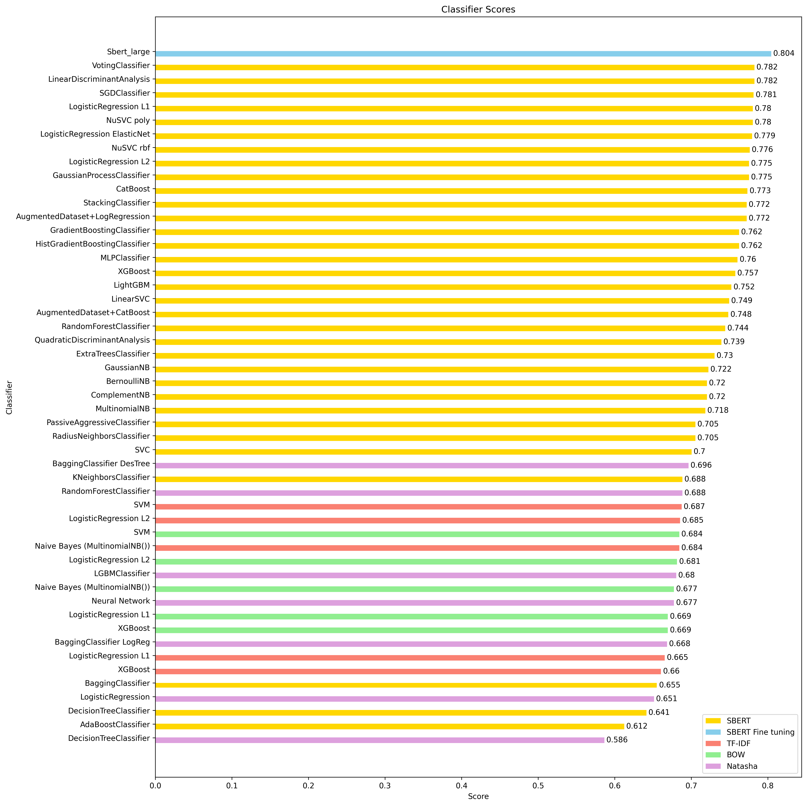

# Результаты тестирования моделей

## Сравнительная таблица

| Vectorizer                    | Classifier                          | Val Score | Train Score |
|-------------------------------|-------------------------------------|-----------|-------------|
| SBERT Fine tuning            | Sbert_large                         | 0.804     | 0.921       |
| SBERT                         | VotingClassifier                    | 0.782     | 0.847       |
| SBERT                         | LinearDiscriminantAnalysis          | 0.782     | 0.831       |
| SBERT                         | SGDClassifier                       | 0.781     | 0.830       |
| SBERT                         | LogisticRegression L1               | 0.780     | 0.832       |
| SBERT                         | NuSVC poly                          | 0.780     | 0.863       |
| SBERT                         | LogisticRegression ElasticNet       | 0.779     | 0.841       |
| SBERT                         | NuSVC rbf                           | 0.776     | 1.000       |
| SBERT                         | LogisticRegression L2               | 0.775     | 0.808       |
| SBERT                         | GaussianProcessClassifier           | 0.775     | 0.862       |
| SBERT                         | CatBoost                            | 0.773     | 0.816       |
| SBERT                         | StackingClassifier                  | 0.772     | 0.861       |
| SBERT                         | AugmentedDataset+LogRegression      | 0.772     | 0.828       |
| SBERT                         | GradientBoostingClassifier          | 0.762     | 0.995       |
| SBERT                         | HistGradientBoostingClassifier      | 0.762     | 0.963       |
| SBERT                         | MLPClassifier                       | 0.760     | 0.832       |
| SBERT                         | XGBoost                             | 0.757     | 0.870       |
| SBERT                         | LightGBM                            | 0.752     | 0.834       |
| SBERT                         | LinearSVC                           | 0.749     | 0.879       |
| SBERT                         | AugmentedDataset+CatBoost           | 0.748     | 0.830       |
| SBERT                         | RandomForestClassifier              | 0.744     | 0.905       |
| SBERT                         | QuadraticDiscriminantAnalysis       | 0.739     | 0.837       |
| SBERT                         | ExtraTreesClassifier                | 0.730     | 0.780       |
| SBERT                         | GaussianNB                          | 0.722     | 0.738       |
| SBERT                         | BernoulliNB                         | 0.720     | 0.743       |
| SBERT                         | ComplementNB                        | 0.720     | 0.734       |
| SBERT                         | MultinomialNB                       | 0.718     | 0.728       |
| SBERT                         | PassiveAggressiveClassifier         | 0.705     | 0.822       |
| SBERT                         | RadiusNeighborsClassifier           | 0.705     | 0.727       |
| SBERT                         | SVC                                 | 0.700     | 0.999       |
| Natasha                       | BaggingClassifier DesTree           | 0.696     | 0.904       |
| SBERT                         | KNeighborsClassifier                | 0.688     | 1.000       |
| Natasha                       | RandomForestClassifier              | 0.688     | 0.956       |
| TF-IDF                        | SVM                                 | 0.687     | 0.998       |
| TF-IDF                        | LogisticRegression L2               | 0.685     | 0.969       |
| BOW                           | SVM                                 | 0.684     | 0.962       |
| TF-IDF                        | Naive Bayes (MultinomialNB())       | 0.684     | 0.881       |
| BOW                           | LogisticRegression L2               | 0.681     | 0.823       |
| Natasha                       | LGBMClassifier                      | 0.680     | 0.960       |
| BOW                           | Naive Bayes (MultinomialNB())       | 0.677     | 0.766       |
| Natasha                       | Neural Network                      | 0.677     | 0.695       |
| BOW                           | LogisticRegression L1               | 0.669     | 0.817       |
| BOW                           | XGBoost                             | 0.669     | 0.803       |
| Natasha                       | BaggingClassifier LogReg            | 0.668     | 0.694       |
| TF-IDF                        | LogisticRegression L1               | 0.665     | 0.708       |
| TF-IDF                        | XGBoost                             | 0.660     | 0.856       |
|                               | BaggingClassifier                   | 0.655     | 0.916       |
| Natasha                       | LogisticRegression                  | 0.651     | 0.691       |
| SBERT                         | DecisionTreeClassifier             | 0.641     | 0.715       |
| SBERT                         | AdaBoostClassifier                  | 0.612     | 0.639       |
| Natasha                       | DecisionTreeClassifier             | 0.586     | 0.762       |

## Результат тестирования ручной нормализации с моделью токенизации sbert
Тестирование приведено в ноутбуке [sbert_normalization_test](https://github.com/kosatchev/ClarityAnalyzer/blob/636410cc88ab1a55d1e1e9516b92d0f90a8741c7/research/sbert_normalization_test.ipynb).

Проверяли, влияет ли предварительная обработка текста на результат токенизации. Тестировали наличие в "сыром" тексте:
* заглавных букв,
* знаков препинания,
* разного формата записи чисел (цифрами или буквами),
* взаимозаменяемых букв "ё" и "е".

**Выводы:**

Модель sbert "из коробки" обрабатывает заглавные буквы и взаимозаменяемость "ё" и "е".

А вот знаки препинания и формат записи чисел на результат токенизации влияют.

Датасет, с которым мы работаем в рамках хакатона, уже предобработан: только маленькие буквы, нет знаков препинания, нет букв "ё", все числа записаны текстом.

Однако это касается только train столбца (результата распознавания моделью ASR). В ручной разметке встречаются буквы "ё" и запятые. Также в ручной разметке встречается дублирование гласных для передачи эмоциональной окраски (например, "эээ" вместо "э"). Учитывая, что ручная разметка участвует в расчете WER для определения метки класса, часть уже проставленных классов может быть некорректной.

Если нужно расширить датасет или провести тестирование на данных не из тестовой части данного датасета, то стоит привести все данные к единому формату. Это также касается и ручной разметки, но в этом случае, вероятно, придется заново оценить метки классов для всего датасета.
